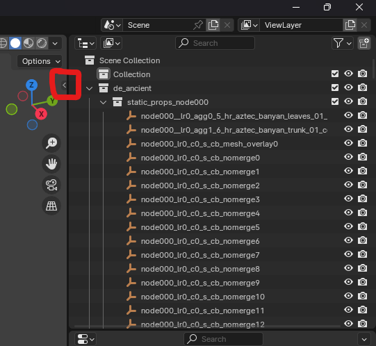
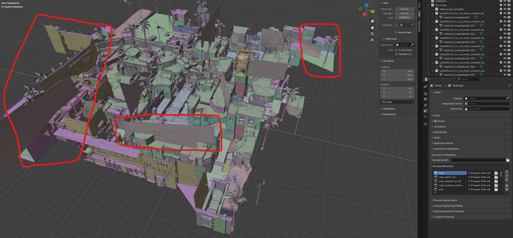

Generating Map USDs
===================

Awpy uses the `Universal Scene Description <https://developer.nvidia.com/usd>`_, or ``.usd/.usdc`` format for its visibility (``awpy.vis``) module. These USDs can be large (i.e., on the order of a few hundred MB) and can be time intensive to create. In this document, we describe how to best create these files.

First, you need to install `Blender <https://www.blender.org/download/>`_ with the `Source Tools <https://developer.valvesoftware.com/wiki/Blender_Source_Tools>` and `SourceIO <https://github.com/REDxEYE/SourceIO>` addons. Please follow the instructions in the respective websites. After opening Blender, you can press A then Delete to remove the camera and starter cube object. Then, to get started, we need to import a map. First go to ``File > Import > Source Engine Assets > Source 2 Packed Map (.vpk)``. Then go to ``C:\Program Files (x86)\Steam\steamapps\common\Counter-Strike Global Offensive\game\csgo\maps\`` and select a map. Be sure to set world scale to 1.0.

Next, open the side panel and go to the View tab and set End to 100,000m:

Then, delete everything except the first category in the scene. Next, delete the blocklight objects by searching for blocklight, Shift+Click to select them and then pressing the Delete button. Do the same for nomerge objects. Next, go through and select all the objects and in the same panel where you adjusted the view, go to the SourceIO, unselect Use Instances (leave Replace Entity selected) and then click Load. You may need to do this in groups of a few dozen in order not to crash Blender.

You should now have a cool looking map in Blender:

Try to clean it up by removing the objects that are clearly outside the map. Be careful, as some objects that are used in one place might show up in another, so do the cleanup in a zoomed out view. When ready to export, press A to select everything and go to ``File > Export > USD``. You can do Selection Only and you just need Normals selected. Everything else can be turned off. Then, there's the USD!